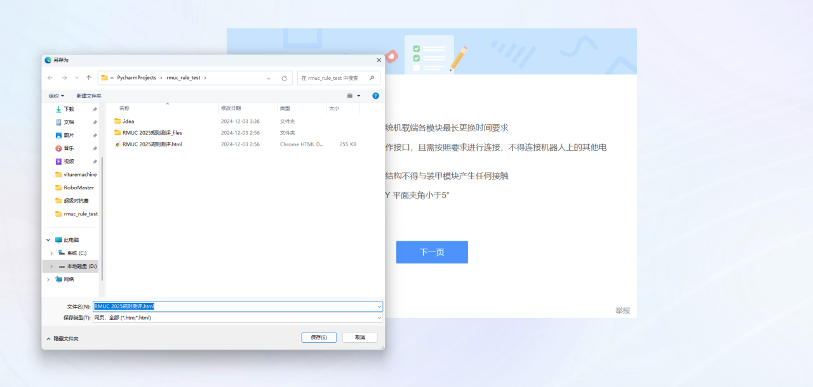

# 基于题库的RoboMaster则测评答案检索脚本

## 使用方法
### 1.保存试题
在浏览器界面cltr+s保存html文件



## 2.构建项目
把“完整题库 最低99最高100.xlsx”文件移到“main.py”、“RMUC 2025规则测评.html”同一目录下。


3.安装依赖
```bash
pip install -r requirement.txt
```

## 特别鸣谢
### 本项目基于冷文傲大佬的脚本改写：https://rcnzopjgoh19.feishu.cn/wiki/ArWBwF0CKirbSuknw0tcqK4bnfh?share_token=84574a5d-825e-421a-9f85-6e7787bd1154

### 本项目依赖于上海科技大学公开的题库

### 感谢昨夜各大高校、RMer的贡献